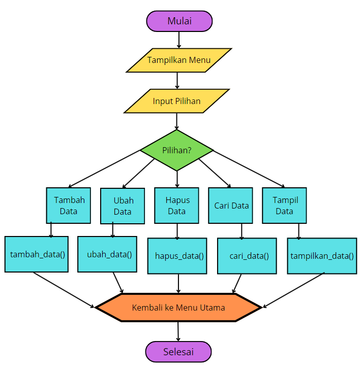
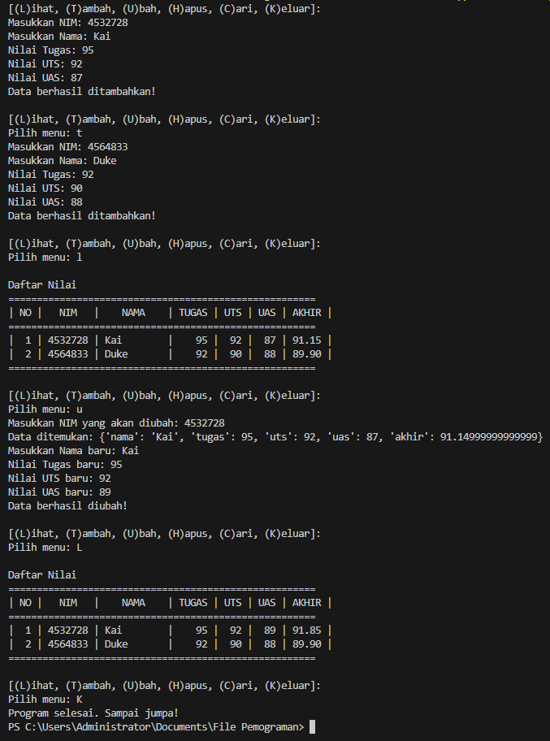

# labpy05

- Nama : Roufan Awaluna Romadhon
- NIM : 31210423
- Kelas : TI.24.A.3

---

## Deskripsi
Program ini bertujuan untuk mengelola data nilai mahasiswa. Program memungkinkan pengguna untuk melakukan beberapa aksi, seperti menambah, mengubah, menghapus, mencari, dan menampilkan data nilai mahasiswa yang disimpan dalam bentuk dictionary. Data yang disimpan meliputi Nama, NIM, Nilai Tugas, Nilai UTS, Nilai UAS, dan Nilai Akhir. Nilai Akhir dihitung berdasarkan bobot yang telah ditentukan, yaitu 30% untuk nilai Tugas, 35% untuk nilai UTS, dan 35% untuk nilai UAS.

---

## Program Manajemen Data Nilai Mahasiswa

### Deskripsi Program:
Program ini memungkinkan pengguna untuk mengelola data nilai mahasiswa dengan cara memasukkan, mengubah, menghapus, mencari, dan menampilkan informasi terkait nilai Tugas, UTS, UAS, dan Nilai Akhir. Data disimpan dalam bentuk dictionary yang menggunakan NIM mahasiswa sebagai kunci, dan setiap entri berisi nama mahasiswa, nilai-nilai akademik, serta perhitungan Nilai Akhir.

### Kode Program
Kode program dapat dilihat dibawah ini atau buka file ini [`DaftarNilaiMahasiwa.py`](DaftarNilaiMahasiwa.py).
```python
# Program Input Nilai
# ======================

data_nilai = {}

def tampilkan_data():
    if len(data_nilai) == 0:
        print("\nDaftar Nilai")
        print("======================================================")
        print("| NO |   NIM   |    NAMA    | TUGAS | UTS | UAS | AKHIR |")
        print("|----|---------|------------|-------|-----|-----|-------|")
        print("|                      TIDAK ADA DATA                  |")
        print("======================================================\n")
    else:
        print("\nDaftar Nilai")
        print("======================================================")
        print("| NO |   NIM   |    NAMA    | TUGAS | UTS | UAS | AKHIR |")
        print("======================================================")
        for i, (nim, data) in enumerate(data_nilai.items(), start=1):
            print(f"| {i:2} | {nim:7} | {data['nama']:<10} | {data['tugas']:5} | {data['uts']:3} | {data['uas']:3} | {data['akhir']:5.2f} |")
        print("======================================================\n")

def tambah_data():
    nim = input("Masukkan NIM: ")
    nama = input("Masukkan Nama: ")
    tugas = int(input("Nilai Tugas: "))
    uts = int(input("Nilai UTS: "))
    uas = int(input("Nilai UAS: "))
    akhir = (tugas * 0.3) + (uts * 0.35) + (uas * 0.35)
    data_nilai[nim] = {"nama": nama, "tugas": tugas, "uts": uts, "uas": uas, "akhir": akhir}
    print("Data berhasil ditambahkan!\n")

def ubah_data():
    nim = input("Masukkan NIM yang akan diubah: ")
    if nim in data_nilai:
        print(f"Data ditemukan: {data_nilai[nim]}")
        nama = input("Masukkan Nama baru: ")
        tugas = int(input("Nilai Tugas baru: "))
        uts = int(input("Nilai UTS baru: "))
        uas = int(input("Nilai UAS baru: "))
        akhir = (tugas * 0.3) + (uts * 0.35) + (uas * 0.35)
        data_nilai[nim] = {"nama": nama, "tugas": tugas, "uts": uts, "uas": uas, "akhir": akhir}
        print("Data berhasil diubah!\n")
    else:
        print("Data tidak ditemukan!\n")

def hapus_data():
    nim = input("Masukkan NIM yang akan dihapus: ")
    if nim in data_nilai:
        del data_nilai[nim]
        print("Data berhasil dihapus!\n")
    else:
        print("Data tidak ditemukan!\n")

def cari_data():
    nim = input("Masukkan NIM yang akan dicari: ")
    if nim in data_nilai:
        print("\nHasil Pencarian:")
        print("======================================================")
        print("|   NIM   |    NAMA    | TUGAS | UTS | UAS | AKHIR |")
        print("======================================================")
        data = data_nilai[nim]
        print(f"| {nim:7} | {data['nama']:<10} | {data['tugas']:5} | {data['uts']:3} | {data['uas']:3} | {data['akhir']:5.2f} |")
        print("======================================================\n")
    else:
        print("Data tidak ditemukan!\n")

while True:
    print("[(L)ihat, (T)ambah, (U)bah, (H)apus, (C)ari, (K)eluar]:")
    pilihan = input("Pilih menu: ").lower()
    if pilihan == "l":
        tampilkan_data()
    elif pilihan == "t":
        tambah_data()
    elif pilihan == "u":
        ubah_data()
    elif pilihan == "h":
        hapus_data()
    elif pilihan == "c":
        cari_data()
    elif pilihan == "k":
        print("Program selesai. Sampai jumpa!")
        break
    else:
        print("Pilihan tidak valid, silakan pilih menu yang tersedia!\n")

```

### Penjelasan Program:
1. Program dimulai dengan inisialisasi dictionary `data_nilai` untuk menyimpan data mahasiswa berdasarkan NIM. Setiap NIM menjadi kunci dan nilai yang terkait adalah dictionary yang berisi nama mahasiswa, nilai tugas, UTS, UAS, dan nilai akhir.
2. Program memasuki loop utama yang menampilkan menu untuk pengguna dengan beberapa pilihan aksi: 1.(L)ihat: Menampilkan seluruh data mahasiswa, 2.(T)ambah: Menambah data mahasiswa baru, 3.(U)bah: Mengubah data mahasiswa yang sudah ada, 4.(H)apus: Menghapus data mahasiswa, 5.(C)ari: Mencari data mahasiswa berdasarkan NIM, 6.(K)eluar: Keluar dari program.
3. Jika pengguna memilih (T)ambah, program akan meminta input untuk NIM, nama, nilai tugas, nilai UTS, dan nilai UAS.
4. Setelah semua input diterima, program akan menghitung nilai akhir mahasiswa dengan rumus: Nilai Akhir = (Nilai Tugas * 0.30) + (Nilai UTS * 0.35) + (Nilai UAS * 0.35).
5. Data mahasiswa yang terdiri dari NIM, nama, nilai tugas, nilai UTS, nilai UAS, dan nilai akhir disimpan dalam dictionary `data_nilai`, dengan NIM sebagai kunci.
6. Jika pengguna memilih (U)bah, program akan meminta NIM mahasiswa yang datanya ingin diubah. Jika NIM ditemukan, pengguna dapat mengubah nama, nilai tugas, nilai UTS, dan nilai UAS. Program kemudian menghitung ulang nilai akhir dan memperbarui data mahasiswa dalam dictionary.
7. Jika pengguna memilih (H)apus, program akan meminta NIM mahasiswa yang ingin dihapus. Jika NIM ditemukan dalam dictionary, data mahasiswa tersebut akan dihapus.
8. Jika pengguna memilih (C)ari, program akan meminta NIM mahasiswa yang ingin dicari. Program kemudian menampilkan data mahasiswa terkait (NIM, nama, nilai tugas, nilai UTS, nilai UAS, nilai akhir) jika ditemukan.
9. Setelah pengguna memilih (L)ihat, program akan menampilkan seluruh data mahasiswa yang telah dimasukkan dalam bentuk tabel.
10. Program terus berjalan hingga pengguna memilih (K)eluar untuk keluar dari loop dan menghentikan program.
11. Program selesai.

### Flowchart:
Flowchartnya adalah sebagai berikut:



### Screenshot Hasil Eksekusi Program:
Berikut adalah hasil eksekusi programnya:


